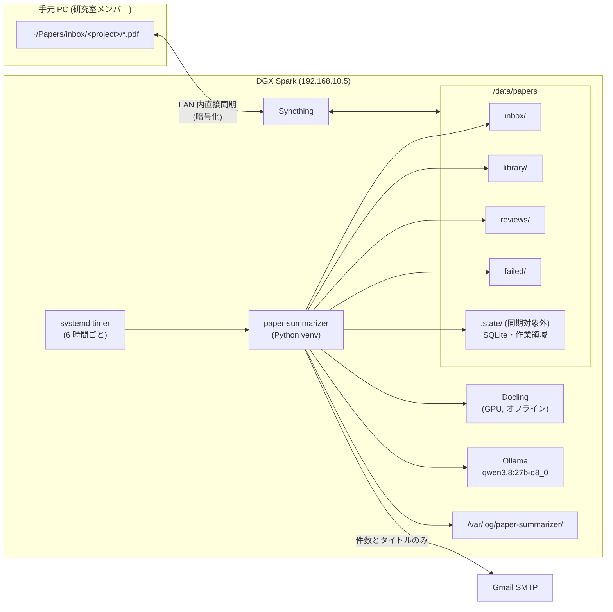
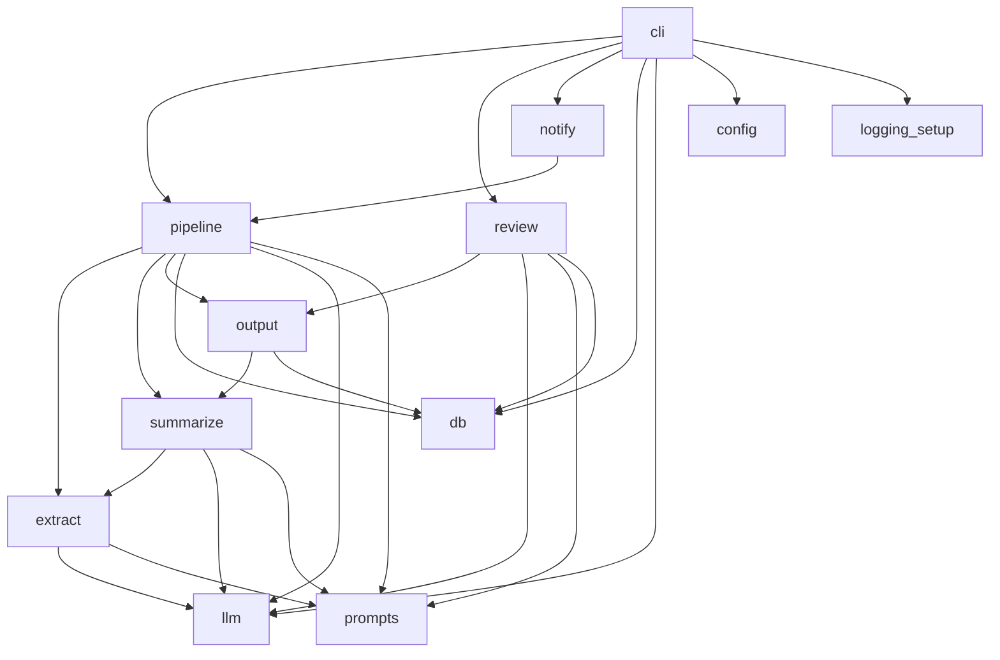
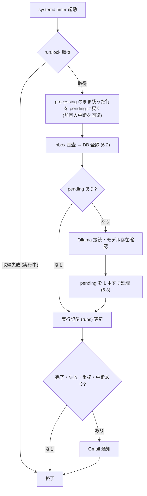
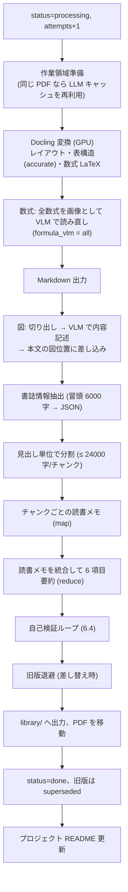
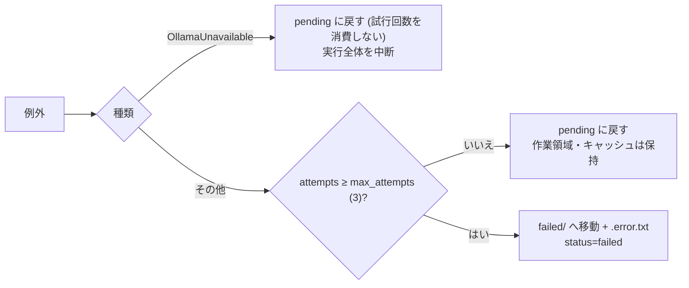
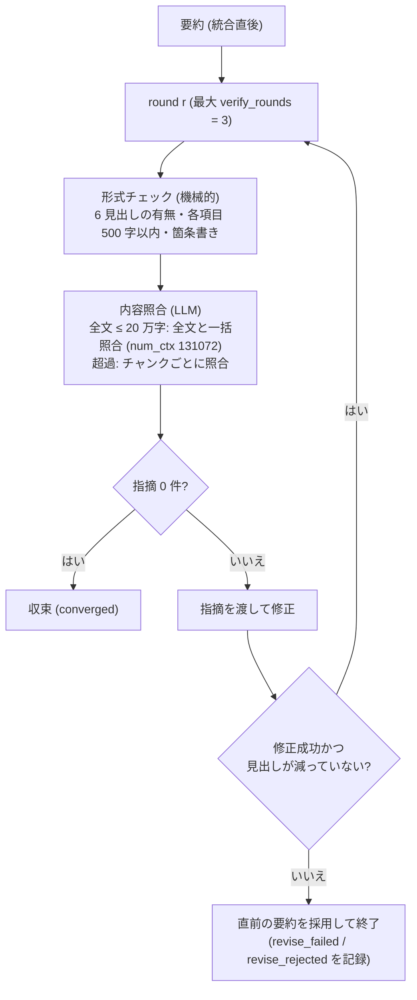
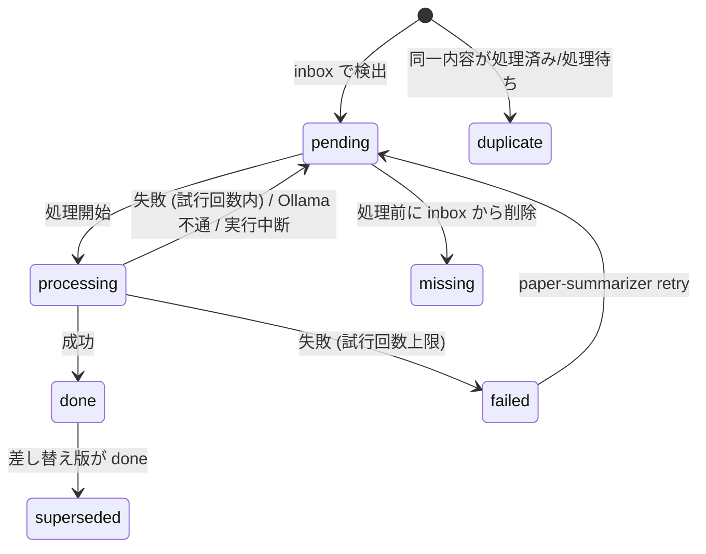

# paper-summarizer アーキテクチャ

DGX Spark 上のローカル LLM で論文 PDF を自動要約するシステムの設計文書。
対象読者: 本システムを運用・改修する研究室メンバー。

- 最終更新: 2026-10-05 (phase-a 統合後)
- リポジトリ: `~/paper-summarizer`

---

## 1. 目的と設計原則

| 原則 | 内容 | 実現方法 |
|---|---|---|
| **論文を外部に出さない** | 論文ファイル・本文・要約を外部サービスに送信しない | 推論はローカルの Ollama、共有は Syncthing の LAN 内直接同期、Docling はオフライン動作 |
| **品質優先** | 処理時間より要約の正確さを優先する | 分割精読 → 統合 → 全文照合による自己検証ループ、図・数式の VLM 読み取り |
| **わかりやすい管理** | 処理状態がフォルダを見ればわかる | `inbox/` → `library/` / `failed/` へのファイル移動 + SQLite での厳密な状態管理 |
| **止まらない・やり直せる** | 1 本の失敗で全体を止めない。途中で落ちても再開できる | 論文単位の例外処理、再試行、LLM 応答キャッシュ、中断検知 |
| **追跡可能** | どのモデル・プロンプトで作った要約か、何が起きたかを後から追える | `meta.json`・`verification.json`、日次ログ、LLM 呼び出し記録 |

---

## 2. システム全体像



### 2.1 外部との通信 (網羅)

| 通信 | 送られるもの | 備考 |
|---|---|---|
| Syncthing (LAN 内) | 論文 PDF・要約 | 端末間の直接通信 (TLS)。グローバル探索・リレーは無効化する設定 |
| Gmail SMTP | 処理件数、論文タイトル、失敗時のファイル名とエラー種別 | 要旨・本文は送らない (`notify.include_titles = false` でタイトルも除外可) |
| Ollama / Docling | なし | 推論はすべてローカル。Docling は `HF_HUB_OFFLINE=1` と事前取得済みモデルで動作 |

モデルのダウンロード (`ollama pull`、`docling-tools models download`) は初回セットアップ時のみ。

---

## 3. 実行環境

| 項目 | 内容 |
|---|---|
| ハードウェア | NVIDIA DGX Spark (GB10, 統合メモリ 128GB, aarch64) |
| OS / CUDA | Linux 6.17 (nvidia), CUDA 13.0 |
| LLM ランタイム | Ollama 0.35.1 (systemd サービス、モデル格納先 `/models/ollama`) |
| LLM | `qwen3.8:27b-mtp-q8_0` — 27.3B dense、Q8_0 (約 30GB)、256K コンテキスト、vision・thinking 対応。MTP (multi-token prediction) により `qwen3.8:27b-q8_0` と同じ重みで生成が約 3 倍速い |
| PDF 抽出 | Docling 2.132 + PyTorch 2.14 (cu130)、GPU 実行 |
| アプリ | Python 3.12 venv (`~/paper-summarizer/.venv`)、依存は `docling`・`httpx` のみ |
| 共有 | Syncthing 1.27 (`syncthing@ito` サービス) |

Ollama の環境変数はアップグレードで消えないよう drop-in (`/etc/systemd/system/ollama.service.d/override.conf`) で設定している。

---

## 4. フォルダ構成

```
/data/papers/                         ← Syncthing 共有フォルダ
├── .stignore                         ← ".state" を同期対象外にする
├── inbox/                            ← 投稿先
│   ├── _unsorted/                    ← inbox 直下に置いたものはここ扱い
│   └── <project>/*.pdf               ← サブフォルダ名 = プロジェクト名
├── library/<project>/<年>_<第一著者>_<短題>/
│   ├── paper.pdf                     ← 元 PDF (inbox から移動)
│   ├── summary.md                    ← 書誌表 + 6 項目要約
│   ├── meta.json                     ← 書誌・モデル・プロンプト版・処理統計
│   ├── verification.json             ← 自己検証の全ラウンドの指摘
│   ├── extracted.md                  ← 抽出本文 (図の読み取り・数式 LaTeX 込み)
│   ├── figures/                      ← 切り出した図・数式画像
│   └── _history/<日時>/              ← 差し替え前の旧版
├── reviews/<project>/
│   ├── README.md                     ← 文献一覧 (自動更新)
│   └── review_YYYY-MM-DD.md          ← 横断レビュー (手動実行)
├── failed/<project>/
│   ├── <name>.pdf                    ← 処理不能・重複
│   └── <name>.pdf.error.txt          ← 理由とスタックトレース
└── .state/                           ← Spark ローカルのみ
    ├── papers.sqlite3                ← 状態 DB
    ├── run.lock                      ← 多重起動防止
    └── work/<paper_id>/              ← 作業領域 (成功時に削除)
        ├── sha256                    ← 対象 PDF のハッシュ (別内容なら作業領域を破棄)
        ├── paper.md / figures/
        └── llm_cache/<hash>.json     ← LLM 応答キャッシュ
```

`library/` のフォルダ名は書誌情報から生成する (`2011_Bozdag_misfit-full-waveform-inversion`)。年が取れない場合は `XXXX`、アクセント付き文字は ASCII 化、衝突時は `_2` を付与。

---

## 5. ソースコード構成

```
~/paper-summarizer/
├── config.toml                ← 全設定 (秘密情報を除く)
├── .env                       ← Gmail 認証情報 (git 管理外, 権限 600)
├── prompts/*.md               ← 全プロンプト (コードから分離)
├── src/paper_summarizer/
│   ├── cli.py                 ← コマンド定義・多重起動ロック・実行記録
│   ├── config.py              ← config.toml / .env 読み込み、フォルダ作成
│   ├── db.py                  ← SQLite スキーマと状態操作
│   ├── pipeline.py            ← inbox 走査、論文単位の処理と失敗処理
│   ├── extract.py             ← Docling 抽出、図・数式の VLM 読み取り、チャンク分割
│   ├── summarize.py           ← 読書メモ → 統合 → 自己検証ループ、形式チェック
│   ├── llm.py                 ← Ollama クライアント (ストリーミング・再試行・キャッシュ)
│   ├── output.py              ← library 出力、旧版退避、プロジェクト README
│   ├── review.py              ← プロジェクト横断レビュー
│   ├── notify.py              ← Gmail 通知
│   ├── prompts.py             ← テンプレート展開とプロンプト版ハッシュ
│   └── logging_setup.py       ← 日次ローテーションログ
├── systemd/                   ← service / timer ユニット
├── tests/                     ← pytest (LLM・Docling 不要の単体テスト)
└── docs/ARCHITECTURE.md       ← 本書
```

モジュール間の依存:



---

## 6. 処理フロー

### 6.1 定期実行 (`paper-summarizer run`)



### 6.2 inbox 走査と登録

対象は `inbox/` 配下の `*.pdf` (大文字小文字を区別しない)。`.` や `~` で始まるパス (`.stversions`、Syncthing の一時ファイル) は無視する。

| 判定 | 条件 | 動作 |
|---|---|---|
| 同期途中 | 最終更新から `min_age_seconds` (120 秒) 未満 | 次回に回す |
| 登録済み | 同じパスで pending/processing の行がある | 内容 (SHA-256) が変わっていれば試行回数をリセット |
| 処理待ちと重複 | 同じ SHA-256 が pending/processing | `failed/` へ移動、`duplicate` として記録 |
| 同一プロジェクトで処理済み | 同じ SHA-256 が同じプロジェクトで done | `failed/` へ移動、`duplicate` として記録 |
| 他プロジェクトで処理済み | 同じ SHA-256 が別プロジェクトで done | 成果物をコピーして done とする (再要約しない) |
| 差し替え | 同プロジェクト・同ファイル名の done があり内容が異なる | `replaces` に旧 ID を記録して pending 登録 → 処理時に旧版を `_history/` に退避して上書き |
| 新規 | 上記以外 | pending 登録 |

走査の最後に、inbox から消えた pending を `missing` にする。

### 6.3 論文 1 本の処理



失敗時:



### 6.4 自己検証ループ



- 内容照合は「誤り (原文と明確に矛盾)」と「欠落 (6 項目にとって重要な事実の欠如)」のみを指摘させ、表現の好みや確信度 low の指摘は除外する。
- 分割照合では「他パートに根拠がありうる記述を誤りとしない」旨を明示する (分割照合で正しい記述が削られる問題への対策)。
- 上限ラウンドに達した場合、最後の修正後の要約は再照合されない。この状態は `summary.md` の「自己検証」欄に表示される。

---

## 7. 状態管理 (SQLite)

### 7.1 状態遷移



### 7.2 テーブル

| テーブル | 主な列 | 用途 |
|---|---|---|
| `papers` | `sha256`, `project`, `source_name`, `inbox_path`, `status`, `attempts`, `last_error`, `replaces`, 書誌 (`title`, `authors`, `year`, `venue`, `doi`), `output_dir`, `model`, `prompt_version`, 時刻, `duration_s` | 論文ごとの状態と成果物の所在 |
| `runs` | `id` (run_id), `kind` (run/review), 開始・終了, `status`, `n_done`, `n_failed`, `error` | 実行単位の記録 |
| `llm_calls` | `run_id`, `paper_id`, `stage`, `model`, `prompt_tokens`, `eval_tokens`, `duration_s`, `ok` | LLM 呼び出しごとのトークン数・所要時間 (性能分析用) |

WAL モード、自動コミット。`run_id` (`YYYYMMDD-HHMMSS-xxxx`) はログの各行にも付与され、DB とログを突き合わせられる。

---

## 8. LLM 呼び出し層 (`llm.py`)

| 機能 | 内容 |
|---|---|
| ストリーミング受信 | `/api/chat` を `stream: true` で呼ぶ。タイムアウトは「トークンが途切れた時間」(`idle_timeout_seconds` = 900 秒) で判定し、全体の処理時間には上限を設けない |
| thinking | 段階ごとに深さを設定 (`[ollama.think_levels]`)。図・数式・書誌・短縮は無効、読書メモ・修正は low、統合・照合・レビューは medium。推論部分は本文から分離され、要約には含まれない |
| 並列実行 | 図・数式・読書メモは `ollama.parallel` 本まで同時に投げる (Ollama の `OLLAMA_NUM_PARALLEL` 以下にする) |
| 時間内訳 | Ollama の応答からモデル読み込み・入力処理・生成の時間を取り、`llm_calls` に記録する |
| 再試行 | 接続エラー・HTTP エラー・生成中エラー (token repeat limit 等)・空応答を、最大 `request_retries + 1` = 3 回まで再サンプリング |
| コンテキスト超過検知 | Ollama は `num_ctx` を超えた入力を黙って切り詰めるため、`prompt_eval_count ≥ num_ctx − 16` で `ContextOverflow` を送出 |
| JSON 応答 | Ollama の `format: json` は生成が大幅に遅くなる (照合 1 回が 219 秒 → 指定なしで 75 秒) ため使わず、プロンプト指示 + パース (失敗時 1 回再生成) |
| 応答キャッシュ | 論文ごとの `work/<id>/llm_cache/` に、(モデル・メッセージ・画像・think・オプション) のハッシュをキーに保存。再試行時は成功済みの段階を再利用する |
| 記録 | 全呼び出しを `llm_calls` テーブルとログに記録 |

### コンテキスト長の使い分け

| 段階 | `num_ctx` |
|---|---|
| 通常 (メモ・統合・修正・図・数式) | 65,536 |
| 全文照合 | 131,072 |
| プロジェクトレビュー | 131,072 |

---

## 9. プロンプト

すべて `prompts/` にあり、`{{変数}}` で展開する。全ファイルの内容ハッシュ (12 桁) を `prompt_version` として `meta.json` と DB に記録する。

| ファイル | 段階 | 役割 |
|---|---|---|
| `paper_summary.md` | 統合 | ユーザー指定の基本プロンプト (6 項目・500 字・階層箇条書き・原語表記) |
| `format.md` | 統合・修正 | 出力形式の厳密な規定 (見出し文言・箇条書き・LaTeX・推測禁止) |
| `chunk_notes.md` | 読書メモ | チャンクから 6 観点の事実を抜き出す。全体の見出し構成を参考として渡す |
| `merge.md` | 統合 | 基本プロンプト + タイトル + アブストラクト + 全読書メモ → 要約 |
| `verify.md` | 照合 | 要約と原文を照合し、誤り・欠落を JSON で返す |
| `revise.md` | 修正 | 要約 + 指摘事項 → 修正版 (論文本文は渡さない) |
| `figure.md` | 図 | 図の種類・軸・傾向・数値・結論を記述 (約 300 字) |
| `formula.md` | 数式 | 数式画像を LaTeX に書き起こす (Docling の読み取り結果を参考に添える) |
| `metadata.md` | 書誌 | 冒頭部分から書誌情報を JSON で抽出 |
| `project_review.md` | レビュー | プロジェクト内の全要約から横断レビューを作成 |

対象分野 (計算科学・土木工学) はメモ・図・数式・レビューのプロンプトに明記している。

---

## 10. プロジェクト単位の機能

| 機能 | 実行 | 内容 |
|---|---|---|
| 文献一覧 `reviews/<project>/README.md` | 論文完了のたびに自動 | 年・第一著者・タイトル・要旨 (項目 1 の冒頭)・要約へのリンク、作成済みレビューへのリンク |
| 横断レビュー `review_YYYY-MM-DD.md` | `paper-summarizer review <project>` (手動) | 全体像・研究の系譜・手法比較・一致点と相違点・未解決課題・推奨する読む順番 |

横断レビューの入力は各論文の要約 (書誌表を除く本文)。合計が `review_max_input_chars` (6 万字) を超える場合は、グループごとに部分レビューを作ってから統合する。

---

## 11. 通知とログ

### 11.1 メール通知

- 送信条件: 完了・失敗・重複・中断のいずれかがあった実行は都度送信する
- 稼働報告: 1 日 1 回、`notify.daily_report_hour` (6 時) 以降の最初の実行で送る。処理がなくても送るため、メールが来ないことで停止に気づける。同じ回に処理があれば 1 通にまとめる。送信済みの日付は `.state/daily_report.date` に記録
  - 内容: プロジェクト別の件数、直近 24 時間の実行回数と失敗・異常終了、Ollama とモデルの有無、ディスク空き、次回の実行時刻
- 件名例: `[paper-summarizer] 完了 1 件 / 失敗 2 件`
- 本文: ホスト名、run_id、完了論文のタイトルと所要時間、失敗 (最終/再試行予定) のファイル名とエラー種別、重複
- 認証情報: `.env` の `NOTIFY_FROM` / `NOTIFY_TO` / `SMTP_PASSWORD` (Gmail アプリパスワード)

### 11.2 ログ

| 種類 | 場所 | 内容 |
|---|---|---|
| アプリログ | `/var/log/paper-summarizer/paper-summarizer.log` | 日次ローテーション、180 日保持。全行に run_id |
| systemd | `journalctl -u paper-summarizer` | 標準エラー出力 (INFO 以上) |
| LLM 呼び出し | `llm_calls` テーブル | 段階別トークン数・時間・成否 |
| 論文ごとの検証履歴 | `library/.../verification.json` | 全ラウンドの指摘内容 |

---

## 12. 運用

### 12.1 定期実行

`systemd/paper-summarizer.service` (oneshot、`User=ito`、`TimeoutStartSec=infinity`、`HF_HUB_OFFLINE=1`) と `paper-summarizer.timer` (`OnCalendar=*-*-* 00/6:00:00`、`Persistent=true`)。

- 実行時刻: 0 時・6 時・12 時・18 時。停止中に時刻を過ぎた場合は起動後に実行
- 前回の実行が続いている間に次の時刻が来た場合、systemd は新しい実行を起動しない (加えてアプリ側でもロックする)

> **状態**: ユニットは未登録 (動作確認後に登録予定)。現在は手動実行。

### 12.2 コマンド

| コマンド | 用途 |
|---|---|
| `paper-summarizer run [--no-notify]` | 定期実行の本体 |
| `paper-summarizer status [--limit N]` | プロジェクト別件数と最近の更新 |
| `paper-summarizer review <project>` | 横断レビュー作成 |
| `paper-summarizer retry <id>` | failed を inbox に戻して再キュー |
| `paper-summarizer reprocess <id>` | 処理済み (done) の論文を再要約。旧版は成功時に `_history/` へ退避 |
| `paper-summarizer readme <project>` | 文献一覧の再生成 |
| `paper-summarizer try <pdf> --out <dir> [--model M]` | DB・ファイル移動なしの試験要約 (モデル比較・プロンプト調整用) |
| `paper-summarizer test-mail` | 通知メールのテスト送信 |

### 12.3 手動実行の注意

端末から `run` を実行するとセッション終了で処理が止まる。手動で長時間実行する場合は切り離して起動する:

```bash
setsid nohup env HF_HUB_OFFLINE=1 .venv/bin/paper-summarizer run \
    > /var/log/paper-summarizer/manual-run-$(date +%Y%m%d-%H%M).out 2>&1 < /dev/null &
```

途中で止まった論文は次回実行時に自動で pending に戻り、LLM キャッシュにより成功済みの段階は再計算されない。

---

## 13. 性能 (実測)

### 13.1 phase-a 適用後 (2026-10-05)

Biometrika 2000 (13 頁) での比較:

| 構成 | 抽出 | 要約 + 検証 | 合計 | 生成速度 |
|---|---|---|---|---|
| 適用前 (q8_0、thinking 一律) | 約 12 分 | 約 58 分 | 69.9 分 | 8.3 tok/s |
| 段階別 thinking | 11.8 分 | 38.6 分 | 50.4 分 | 8.3 tok/s |
| 段階別 thinking + MTP + 短縮工程 | 4.8 分 | 25.1 分 | **29.9 分** | 21〜28 tok/s |

### 13.2 適用前 (q8_0、thinking 一律)

`qwen3.8:27b-q8_0`、生成速度は約 8〜9 トークン/秒 (27B dense をメモリ帯域 273GB/s で動かす際の上限付近)。

| 論文 | 本文 | 図 / 数式 | 抽出 (Docling + VLM) | 要約 + 検証 | 合計 |
|---|---|---|---|---|---|
| Geophys. J. Int. 2011 (26 頁) | 9.3 万字 | 21 / 58 | 約 25 分 | 約 109 分 (検証 2 ラウンド) | 133.6 分 |
| J. Comput. Phys. 2016 (26 頁) | 10.7 万字 | 33 / 62 | 約 24 分 | 約 123 分 (検証 3 ラウンド、指摘 9→3→0) | 147.1 分 |
| Biometrika 2000 (13 頁) | 4.4 万字 | 2 / 37 | 約 12 分 | 約 58 分 (検証 2 ラウンド、指摘 1→0) | 69.9 分 |

段階別の目安 (J. Comput. Phys.): 読書メモ 5〜10 分/チャンク (6 チャンク)、統合 11 分、全文照合 12 分 (入力 3.4 万トークン)、修正 11 分。

1 本あたり 1.5〜2.5 時間。6 時間ごとの実行で 1 回あたり 2〜4 本が目安。

---

## 14. 開発時の主な設計判断

| 判断 | 理由 |
|---|---|
| Google Drive ではなく Syncthing | Drive はファイルが Google のサーバーに保存され、「外部に出さない」要件と両立しない |
| 要約用と VLM を同一モデル | Qwen3.8 は vision 対応。モデル切り替えによるロード時間とメモリを節約 |
| 全数式を VLM で読み直す | Docling の数式認識は誤読しても空にならず、崩れた LaTeX を出力するため失敗検知ができない |
| 照合は可能な限り全文で | 分割照合では、他パートに根拠がある正しい記述を「誤り」と判定し、修正で削ってしまう現象が実測で発生 |
| 短縮工程は thinking なし | thinking を有効にすると文字数を「+1+1+1…」と数え続けるループに陥り、1 回 8,800 トークンを消費した |
| `format: json` を使わない | Ollama の制約付き生成で照合段階が大幅に遅くなった (qwen3:30b での試験時、1 回 219 秒。指定なしでは 75 秒) |
| 修正プロンプトに基本プロンプトを含めない | 「論文全体を読み込み」の指示があるのに本文がない状態で、thinking だけで終わり本文が空になる現象が 3 本中 2 本で発生。対策後は修正 4 回すべて成功 |
| 照合失敗を「指摘なし」と扱わない | 照合応答の JSON が読めなかったとき指摘 0 件 = 収束と誤判定し、未検証の要約が「指摘なし」と表示された。現在は未検証として記録・表示する |
| JSON 中の LaTeX バックスラッシュを文字どおり解釈 | 数式を含む指摘で JSON が不正になる、または `\frac` の `\f` が改ページに化けるため |
| temperature 0.6 | thinking モードで低温度にすると推論が反復ループしやすい (Qwen 推奨値) |
| 論文単位・段階単位の失敗分離 | 数式 1 つ・修正 1 回の失敗で論文全体 (1〜2 時間分) を失わないため |

---

## 15. 既知の制約と今後の課題

| 項目 | 内容 |
|---|---|
| 処理速度 | phase-a 適用で 13 頁の論文が 69.9 分 → 29.9 分。並列実行 (OLLAMA_NUM_PARALLEL) の効果は計測予定 |
| 最終修正後の再照合なし | 検証ラウンド上限に達した場合、最後の修正版は照合されない |
| 文字数超過 | 統合段階では 500 字上限が守られにくく (実測 747〜1741 字)、検証の 1 ラウンド目が文字数修正に使われる |
| 発行年の欠落 | Docling が欄外 (例: `Biometrika (2000), 87, 1`) を除去するため年・誌名が取れないことがあった。書誌抽出に PDF 1 ページ目の生テキストを渡して対策済み。arXiv プレプリント等で本当に年の記載がない場合は `XXXX` |
| スキャン PDF | 既定は OCR 無効 (`extract.ocr = true` で対応) |
| 研究室での共有 | 現在は個人用。複数人での利用時は Syncthing のデバイス追加、または Samba 共有の追加を検討 |
| 学外アクセス | Syncthing のリレーは無効のため、学外からは VPN (Tailscale 等) 経由が前提 |
